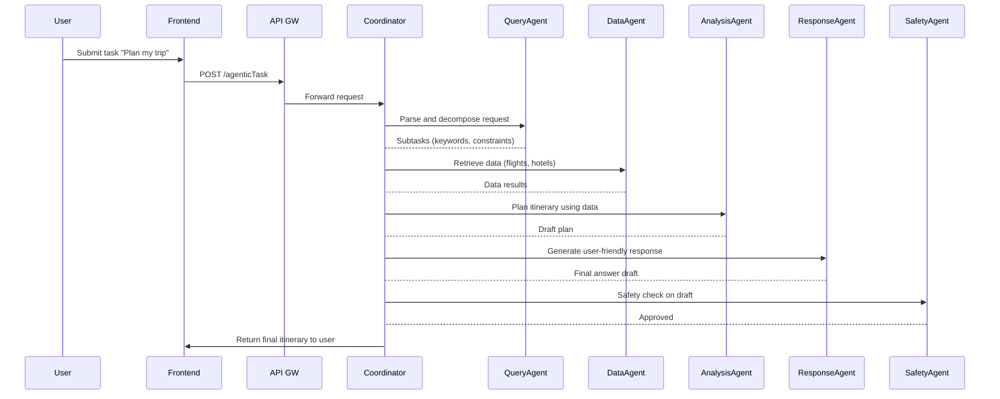
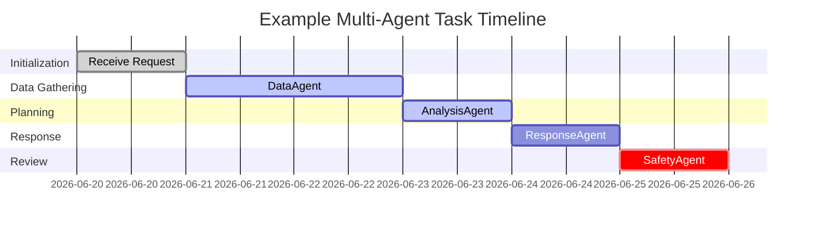

# AI System Design: Concepts, Patterns, and Agentic Architectures

## Executive Summary

This report provides a comprehensive analysis of **AI system design**, synthesizing foundational principles, architecture patterns, and component-level details to guide the construction of robust, scalable AI solutions. We begin by defining the goals of AI system design and extracting explicit requirements from the user-provided content. Key design principles – including **scalability, reliability, safety, interpretability, modularity, governance, privacy, latency, and cost** – are discussed in depth. We compare common architecture patterns (microservices, event-driven pipelines, agentic/multi-agent, and hybrid) and map out a detailed system workflow with data flows, component responsibilities, and hand-offs. 

Component-level considerations such as data ingestion, preprocessing, feature storage, model training and serving, orchestration, monitoring, CI/CD (MLOps), and security are addressed. We also explore interfaces and APIs, typical data-flow and failure scenarios, and rigorous testing and validation strategies (unit testing, data/ML validation, canary/A–B testing, fairness checks). Ethical and regulatory compliance – including data privacy (GDPR/CCPA), bias/fairness, transparency, and auditability – are integrated throughout the design. 

Trade-offs in design choices are explicitly analyzed with comparison tables (e.g. batch vs real-time inference, Kubernetes vs serverless orchestration) to aid decision-making. Finally, we present a detailed **multi-agent (agentic) architecture** example: a hypothetical complex AI application wherein multiple specialized agents (coordinator, data retriever, analyzer, responder, safety overseer, etc.) collaborate to achieve a goal. This example includes mermaid diagrams for the overall architecture and sequence flow, a timeline chart of agent interactions, and strategies for failure handling and scalability. All claims are supported by authoritative sources and seminal works. 

Throughout, we assume a generic AI application scenario (no specific domain given), and we explicitly note any assumptions made. The result is an analytical, in-depth guide to AI system design – from first principles to concrete implementation details – suitable for mission-critical production deployments.

## System Requirements and Constraints

Based on the provided content (and common industry practices), the following **requirements and constraints** are derived for the AI system design:

- **Tiered, Modular Architecture:** Separate the system into distinct layers (e.g. client, API gateway, business logic, model inference) to isolate concerns and enable scalability and security.  
- **Scalable Infrastructure:** Use horizontal scaling (auto-scaling groups, container orchestration) to handle variable load. No single point of failure; redundant instances of services (e.g. model servers) must be provisioned.  
- **Caching and CDN:** Deploy CDNs and caching layers (in-memory caches like Redis) for static content and frequent queries to reduce latency and load on origin servers.  
- **Storage by Access Pattern:** Use appropriate storage engines (e.g. SQL databases for relational data, NoSQL/document stores for flexible data, key-value stores for fast lookup) and in-memory data stores for high-speed access.  
- **API Design and Validation:** Expose a well-defined API contract (e.g. REST or gRPC or GraphQL) with strict input validation (JSON schema, OpenAPI/Swagger) and rate-limiting.  
- **Authentication and Authorization:** Enforce strong identity and access controls at all service boundaries (OAuth/JWT, role-based IAM). All external endpoints must be protected.  
- **Encryption In Transit and At Rest:** All data in flight must use TLS; sensitive data at rest must use strong encryption (e.g. AES-256). Secrets and keys should be securely managed (e.g. KMS).  
- **High Availability:** Services (API gateways, load balancers, model inference pods) must be multi-instance across zones/regions. Load balancers should distribute requests and detect unhealthy instances.  
- **Observability:** Integrate centralized logging (ELK/Cloud Logging), metrics (Prometheus/Cloud Monitoring), and tracing to monitor system health. Log model outputs, latencies, error rates, and data distribution (to detect drift).  
- **Automated Machine Learning Pipeline:** Implement continuous data pipelines for feature extraction and model retraining. New data should automatically trigger preprocessing and incremental model updates (subject to validation).  
- **CI/CD / MLOps Pipeline:** Apply DevOps practices to ML: automate build-test-release of models and code. Incorporate versioning for data, models, and code (e.g. model registry like MLflow) and enable automated testing (unit tests for data transformers, integration tests for model predictions).  
- **Data Governance:** Enforce data quality checks and lineage tracking. Anonymize personal data where possible. Maintain audit logs of data access and model decisions to support compliance.  
- **Fairness and Ethics:** Continuously evaluate models for bias and fairness (e.g. demographic parity metrics). Include mechanisms for bias detection, content moderation, and human review if needed.  
- **Privacy Compliance:** Comply with regulations (GDPR, CCPA, etc.) by design: minimal data retention, user consent tracking, data deletion procedures. Possibly employ differential privacy or federated learning if required for sensitive data.  
- **Transparency:** Provide explainability (e.g. logging feature importances or using interpretable models) and keep detailed records of model logic. This aids debugging and regulatory audits.  
- **Performance (Latency and Throughput):** Define acceptable response times. Use GPU/TPU acceleration or optimized runtimes (TensorRT, ONNX Runtime) for latency-critical inference.  
- **Cost Constraints:** Monitor resource usage and costs. Use spot/preemptible instances for non-critical jobs and autoscaling to optimize cost versus performance.  
- **CI/CD Quality:** All code (service logic, data pipelines) must include automated tests, input validation, and error handling. For example, data transformers and API handlers should have unit tests for edge cases.  

**Assumptions:** The specific application domain is unspecified, so we assume a generic AI service (e.g. a web-based AI application) serving many users. We assume high data volumes and query rates, necessitating distributed design. Technologies are left general (no particular cloud provider is required, though examples may reference popular services). We assume availability of standard tools (containers, orchestration, ML frameworks) and that best-practice guidelines (e.g. Google’s MLOps, Well-Architected Framework) are followed.  

## Definitions and Goals of AI System Design

**AI system design** refers to the architecture and process of building software systems that incorporate machine learning or other AI models as a core component. Unlike traditional software, AI systems must manage large data flows and continuous model updates in addition to typical business logic. The goal is to meet both **functional requirements** (correct predictions or actions) and **non-functional requirements** such as scalability, reliability, and maintainability. 

As one author notes, *“system design is the art and science of architecting software and hardware to meet functional and non-functional requirements”*. For AI systems specifically, the core design principles include **scalability, reliability, availability,** and **maintainability**.  In practice, an AI system should be **scalable** to handle growing data and model complexity (e.g. training on terabytes of data), **reliable** so it continues to function correctly even if components fail, **highly available** to serve user requests at any time, and **maintainable** so that models, data pipelines, and code can evolve without extensive rewriting. 

Additional AI-specific goals include:  
- **Performance:** Low latency for user-facing inference and high throughput for training and batch tasks.  
- **Accuracy and Robustness:** Models should meet accuracy targets and degrade gracefully under uncertainty.  
- **Interpretability:** In regulated or sensitive domains, the system should allow inspection of model decisions (e.g. via explainability tools).  
- **Governance and Compliance:** The design must enable auditing of data and decisions, and adherence to privacy regulations.

All these goals must be balanced. For example, achieving very low latency may increase cost, or ensuring the highest consistency may incur additional delay (CAP theorem trade-offs). The sections below elaborate on how to realize these goals through appropriate principles and architecture patterns.

## Key Design Principles

An AI system’s architecture should be guided by the following key principles:

- **Scalability:** Design the system to grow with demand.  Use **horizontal scaling** (adding more machines/containers) for services such as data processing and model serving. For instance, distributing data preprocessing and training across a cluster of machines accelerates throughput. Use managed services or container orchestration (Kubernetes, auto-scaling groups) to elastically scale out inference and pipeline components as load increases.

- **Reliability (Fault Tolerance):** Eliminate single points of failure. Replicate critical components (load balancers, model servers) across availability zones and clusters. Implement **health checks** and auto-restart policies. For example, if one model-serving container crashes, traffic should automatically fail over to another instance running the same model version. Use retry logic and circuit breakers to handle transient failures. Fault isolation (as in microservices) ensures that failures in one service (e.g. data ingestion) do not cascade to others.

- **Availability:** Target “always on” operation through redundancy and distribution. Employ multiple load-balanced instances and regional replication of data. Use **graceful degradation**: if a high-cost component fails, the system can still offer basic functionality. For example, if real-time inference fails, the system might fall back to a cached result or a simpler heuristic. Aim for design patterns like blue/green or canary deployments to update without downtime.

- **Modularity and Maintainability:** Keep components small and self-contained. Decompose the system into services (e.g. ingestion, preprocessing, training, inference, monitoring). This modularity enables teams to update, test, and deploy each part independently. For example, adding a new feature extractor should not require redeploying the API or retraining existing models. Clear separation of concerns (for example, isolating the feature store from the model-serving logic) makes the system easier to understand, test, and extend.

- **Observability and Monitoring:** Build in comprehensive logging, metrics, and tracing. Monitor system health (CPU, memory, throughput), and track ML-specific metrics (prediction latencies, model confidence distributions, data drift). Real-time dashboards and alerts help detect issues early (e.g. sudden drop in accuracy or spike in errors). Version events such as model changes or data schema updates should be logged for traceability.

- **Security and Safety:** Apply **defense in depth**. Use strong authentication/authorization (OAuth, IAM roles) for all services; enforce least privilege. Encrypt all sensitive data in transit (TLS) and at rest (AES-256). Perform input sanitization and validation to prevent injection attacks. Employ specialized safeguards for models: for example, Google’s *Model Armor* inspects inputs/outputs to detect prompt injections or malicious content. Consider having a “safety agent” or filter that reviews or moderates model outputs before release. Log model decisions and include manual review points for high-risk cases.

- **Interpretability and Transparency:** Especially for regulated domains, ensure some level of explainability. This could include logging feature importances, providing interpretable model alternatives, or attaching rationales to predictions. For complex agentic flows, maintain a clear audit trail of each agent’s decisions (who did what, and why). This aids debugging and regulatory compliance.

- **Data Governance:** Manage data quality, lineage, and compliance. Track data sources and transformations (version control for data schemas, pipeline runs). Ensure **data privacy** – minimize PII exposure, anonymize or pseudonymize data where required. Maintain audit logs of data access and modeling decisions (e.g. who retrained the model when) to satisfy governance requirements.

- **Fairness and Ethics:** Continuously test models for bias. Incorporate bias/fairness testing suites to measure disparities (e.g. demographic parity, equalized odds) and mitigate them if thresholds are not met. Include ethical guidelines (e.g. avoid offensive outputs) in the pipeline. When deploying multi-agent logic, ensure that no agent colludes in harmful ways and that cascaded decisions are checked for unwanted bias.

- **Latency and Performance:** Different use-cases have different latency requirements. For low-latency applications, use real-time serving (see trade-offs below) and optimized inference runtimes (GPU/TPU, TensorRT). If permissible, leverage batch or nearline processing to amortize cost. Techniques like asynchronous request handling and prioritization queues help meet SLAs.

- **Cost Efficiency:** Balance performance with cost. Use auto-scaling to pay only for needed capacity. Consider serverless functions or managed services for infrequent tasks to reduce overhead. Profile bottlenecks and reserve specialized resources (GPUs, memory) only where necessary. 

Overall, the design should **ensure security, scalability, and observability** as first-class considerations. Each decision (architecture style, component choice, technology stack) is justified by these principles and any specific constraints (e.g. latency budget, regulatory rules).

## Architecture Patterns

Several architectural patterns are well-suited to AI systems; often a hybrid of patterns is used:

- **Microservices Architecture:** Decompose the AI system into independent services (e.g. data ingestion, feature processing, model training, model serving, monitoring) that communicate over network APIs. Each service can use the best-fitting technology stack and scale independently. For example, Netflix and Uber have successively applied microservices for data pipelines and ML tasks.  Advantages include clear modularity, fault isolation (a failure in one microservice need not crash the entire system), and technology heterogeneity (services can be in different languages). The trade-off is increased complexity in communication and deployment, and the need for orchestrating many moving parts (often with containers and Kubernetes).

- **Event-Driven Architecture:** Use asynchronous messaging (e.g. Kafka, Cloud Pub/Sub) for data and control flows. Incoming data (like user events or sensor readings) are treated as events that trigger pipelines. Each processing step subscribes to relevant event streams and emits new events upon completion. This decouples producers and consumers and allows real-time or near-real-time processing. It supports elasticity (you can scale consumers independently) and resilience (events can be replayed on failure). Event-driven systems fit AI inference pipelines that react to new data or user requests. For example, IoT data ingestion or online feature updates often use an event-driven model. The trade-off is that debugging and ensuring exactly-once processing can be harder, and system state is implicitly managed through events.

- **Pipeline (Batch or Stream) Architecture:** Emulate a classic ML pipeline (as in TensorFlow Extended, Kubeflow Pipelines, or Airflow DAGs) where data flows through sequential stages: ingestion → validation → transformation → training → deployment. In batch pipelines, data is processed in bulk (e.g. nightly ETL jobs), which is simpler and cost-effective for non-real-time needs. Stream pipelines handle continuous data (e.g. Kafka Streams, Spark Streaming) for real-time features. Pipelines ensure reproducibility and versioning of data transformations (often via metadata stores). The trade-off is added orchestration overhead and latency (batch pipelines introduce delays). Many large organizations use hybrid pipelines: offline batch for model training, online micro-batches or streams for serving.

- **Agentic / Multi-Agent Architecture:** In this pattern, a **coordinator agent** oversees the process and invokes multiple specialized subagents to achieve a goal. For example, one agent retrieves data, another analyzes it, another generates a response, etc. Agents communicate via well-defined protocols (e.g. the open Agent2Agent (A2A) protocol). This pattern is especially useful for complex, goal-driven tasks where decomposition and iterative refinement are needed. Google’s reference architecture for a multi-agent AI system exemplifies this: a coordinator dispatches tasks to subagents, which operate in sequential or iterative patterns (with optional human-in-the-loop review). The advantage is that each agent can use a tailored AI model or logic, leading to high-quality solutions. The drawbacks are higher architectural complexity, potential communication overhead, and the need for robust orchestration (patterns include centralized vs. decentralized vs. hierarchical orchestration). We discuss a concrete multi-agent example below.

- **Hybrid Architectures:** In practice, systems often combine patterns. For instance, the high-level structure may be microservices, one of which implements an event-driven pipeline, while another is an agentic workflow. Core services might run on Kubernetes (microservices), some utilities might be serverless (functions for ETL), and a messaging bus connects them. The hybrid approach allows tailoring each part to its workload, but requires careful integration and clear interfaces.

In choosing among these patterns, consider the workload and requirements. Microservices + containers are a default for large-scale systems. Use event-driven design if real-time reaction to data/events is critical. Use pipelines (with orchestration tools like Airflow, Kubeflow, or Cloud Composer) for repeatable ML workflows. Use agentic decomposition for complex decision-making tasks. In all cases, patterns should support **observability, security, and scalability** by design.

## System Components and Data Flow

A robust AI system typically includes the following components and data flows (each component can itself be a microservice or module):

- **Data Ingestion Layer:** Collects raw data from sources (user inputs, databases, IoT sensors, third-party APIs). Can include API endpoints, message queues, or connectors (e.g. CDC tools). It may apply basic validation and normalization. High-throughput systems use distributed ingestion (Kafka, Kinesis) with replication to ensure durability.

- **Preprocessing and Feature Engineering:** Raw data is cleaned, filtered, and transformed into features. This may involve data validation (schema checks), imputation of missing values, encoding of categorical variables, normalization/scaling, and extraction of domain-specific features. These steps can be implemented in batch (e.g. Spark jobs, Beam pipelines) or real-time (Flask endpoints, streaming jobs). A **feature store** component may centralize commonly used features, ensuring that feature computation is consistent between training and serving.

- **Feature Store:** A specialized datastore for validated feature vectors. It supports both offline feature retrieval (for training) and real-time lookup (for inference). Feature stores enforce consistency: features used in training are computed the same way at serving time. They also facilitate sharing and reuse of features across teams. Examples include Feast, Tecton, and cloud-native solutions. Using a feature store simplifies data governance (tracking feature lineage) and ensures that the model sees data of the same format it was trained on.

- **Model Training (Offline):** A scalable training environment (e.g. GPU cluster, distributed training framework) builds new models. Training jobs consume data from the data lake or feature store. Training may be continuous (e.g. nightly retrains) or on-demand (triggered by new data or on schedule). This component outputs trained model artifacts and evaluation metrics. Training jobs should be containerized and possibly orchestrated (e.g. Kubeflow, Airflow, or cloud ML services) to ensure reproducibility and resource management. A **model registry** (versioned model repository) stores models, so any version can be deployed or rolled back.

- **Model Validation:** Before promotion, each trained model is validated on held-out data and possibly in shadow mode. Automated tests measure accuracy, AUC, or other metrics, and perform **bias/fairness checks** (e.g. disparity across groups). Models that fail quality gates are not deployed. This step is part of the MLOps pipeline.

- **Model Serving (Inference):** The deployment of models for real-time or batch predictions. In real-time serving, the model is loaded in a service (often containerized) behind an API (REST/gRPC) or message queue consumer. Each request is processed by the model to produce an inference. If latency is critical, use optimized model runtimes (TensorRT/ONNX) and ensure auto-scaling of serving pods. In batch serving, data is collected and processed in bulk (e.g. Hadoop/Spark jobs or scheduled batch jobs), which is simpler but not suitable for interactive workloads. The choice (real-time vs batch) is a trade-off discussed later. 

- **API and Frontend:** The client-facing interface (web/Mobile app, dashboards, third-party integrations). The frontend communicates via an API gateway or load balancer to backend services. The API layer handles request routing, authentication, and input validation. It may also aggregate results from multiple services (e.g. a JSON API that calls the model-serving service and other microservices).

- **Orchestration and Workflow Management:** Orchestrators (e.g. Airflow, Kubeflow, Argo, AWS Step Functions) manage complex pipelines and agent workflows. They trigger and coordinate tasks (data ingest, feature computation, training jobs, sequential agent calls) and can run on schedules or event triggers. In a multi-agent scenario, a coordinator orchestrator invokes subagents in sequence or loop.

- **Monitoring, Logging, and Telemetry:** Observability components collect logs (system logs, audit logs, model input/output logs), metrics (latency, error rates, resource usage, model performance over time), and traces. These are fed into monitoring tools (Prometheus/Grafana, CloudWatch, Stackdriver). Anomaly detection on these metrics can trigger alerts (e.g. a sudden drop in throughput or model accuracy). For example, if model predictions fall below a threshold, an alert might start a retraining pipeline or roll back to a previous model.

- **CI/CD and MLOps:** A continuous delivery pipeline manages code and model deployments. For model code, use code repositories (Git) with automated builds and tests (Lint, unit tests for data pipelines, integration tests for service endpoints). For models, the pipeline includes packaging the model artifact, running validation tests, and deploying to production (often via blue/green or canary releases). Tools like MLflow, TFX, or cloud ML platforms provide integrated MLOps features (model registry, experiment tracking, automated promotion).

- **Security Components:** Include IAM services, API gateways/firewalls, secrets vaults, and encryption services. Data storage (databases, S3 buckets) must enforce IAM roles. Secrets (API keys, credentials) should be in a key vault. Network traffic should reside in VPCs with limited access. If using agents that call external APIs or tools, ensure those calls are authenticated and safe.

**Data Flow Example:** Client requests or new data → Ingestion service → Preprocessing → Feature Store → Model Training → Model Registry → Model Serving → API response to client. Monitoring hooks into each step (e.g. ingestion emits events to logging, serving emits metrics). 

**Failure Modes:** Data pipeline failures (e.g. ingestion service unavailable) should be retried or routed to dead-letter queues. Model serving failures should trigger fallback logic or health alerts. Model degradation (drift) should be detected by monitoring and trigger retraining. Resource exhaustion (CPU/memory spike) should auto-scale or throttle new requests. Security breaches (e.g. unusual API usage) should be detected by anomaly monitoring.

## Interfaces and APIs

The system’s interfaces must be well-defined and secure. Common API patterns include:

- **Public Client API:** Typically RESTful or GraphQL for web/mobile clients. Use schema definitions (OpenAPI/Swagger) to validate and document endpoints. For example, a REST API might expose endpoints like `/predict` and `/feedback`. Input validation and rate limiting are enforced at the API gateway. Among options, REST is ubiquitous with caching via HTTP, GraphQL allows precise queries (at cost of complexity), and gRPC excels at high-performance internal service calls (requires protobufs).

- **Internal Service API:** Microservices often communicate via REST or gRPC. gRPC (with HTTP/2) is preferred for low-latency, bi-directional streaming (e.g. streaming data or logs) between services.

- **Webhooks / Message Interfaces:** For event-driven designs, services publish events (Kafka topics, cloud pub/sub) that other services subscribe to. This asynchronous interface decouples producers/consumers.

- **Human-Machine Interfaces:** If the system includes a human-in-the-loop (HITL), design web dashboards or UIs for intervention. For example, a UI for data labeling or for reviewing flagged model outputs.

Each API should include authentication requirements (e.g. `Authorization: Bearer` tokens) and strict schema enforcement. A centralized API gateway or service mesh can manage these cross-cutting concerns (authentication, logging, metrics).

## Data Flows and Failure Modes

**Typical Data Flows:** (1) *Inference Flow:* Client → API Gateway → Load Balancer → Model Serving Service → Database/Feature Store → Model (inference) → Response → Monitoring. (2) *Training Flow:* Ingested raw data → Data Lake/DB → Preprocessing Service → Feature Store → Training Job → Model Artifact → Model Registry → Deploy to Serving. 

**Failure Modes:** Consider the following and mitigation strategies:

- **Ingestion Failure:** If an upstream data source or stream (e.g. Kafka) fails, the system should enqueue retries or switch to a backup feed. Monitor lag and throughput.

- **Data Quality Issues:** If incoming data fails validation (e.g. schema mismatch), pipeline should log the incident and discard or quarantine bad records, rather than crash.

- **Model Serving Outage:** If a model server crashes or saturates, the load balancer should reroute to healthy instances. A lightweight fallback (e.g. last-known output or a simpler heuristic) can ensure continuity until service is restored.

- **Model Drift:** Over time, the model may degrade (due to data distribution shift). Continuous monitoring of model metrics (e.g. accuracy on a validation stream) should trigger retraining pipelines when performance drops.

- **Pipeline Breaks:** In a multi-step pipeline (ingest→preprocess→train), failures in an intermediate step (e.g. feature computation error) must be detected (through logs/alerts) and either auto-corrected or paused until fixed, with tasks queued.

- **Coordination/Agent Failure:** In a multi-agent setup, if one agent (e.g. a sub-agent in a sequence) fails, the coordinator should have a timeout and either retry with another agent or escalate to a human review path. Ensure no single agent causes complete deadlock (e.g. via watchdog timers).

- **Security Breach:** Unusual spikes in traffic or anomalies in data should raise alerts. For example, a sudden drop in model confidence could indicate adversarial input. Rate-limit suspicious IPs and quarantine flagged requests.

Designing for failover and graceful degradation (e.g. circuit breakers, bulkheads) is essential. For each component, plan for monitoring and alarms so that human operators can intervene quickly.

## Testing and Validation

Comprehensive testing is critical:

- **Unit Tests:** Every component (data transformers, API handlers, utility functions) must have unit tests covering typical and edge cases. For example, test that the preprocessing code handles missing or malformed data gracefully.

- **Integration Tests:** Test interactions between services. For example, a dummy end-to-end test might push known input through the API gateway and verify the output. Mock external systems when possible.

- **Data Validation:** Continuously validate incoming data against schemas. Use tools like TensorFlow Data Validation (TFDV) or Great Expectations to detect anomalies in data distribution. This prevents “garbage in, garbage out” errors.

- **Model Validation:** Evaluate each model on held-out test data (accuracy, confusion matrix). Perform *bias/fairness tests*: e.g. compute parity or equality-of-opportunity metrics across demographic groups. If thresholds are not met, reject the model.

- **Canary and A/B Testing:** Deploy a new model to a small subset of traffic (e.g. 5–10%) and compare performance against the incumbent. Use statistical tests to detect regressions. Only roll out to 100% if the new model performs satisfactorily. This real-world testing can catch issues not seen offline.

- **Performance and Load Testing:** Simulate high request loads to ensure the system meets latency and throughput requirements. Use stress tests to find bottlenecks. For model-serving, measure throughput per GPU/instance and ensure auto-scaling triggers at the right thresholds.

- **Security Testing:** Include penetration testing and fuzzing of inputs. Verify that authentication/authorization controls cannot be bypassed.

- **Bias/Fairness Checks:** Beyond validation data, perform ongoing fairness monitoring in production. Periodically audit model outputs for systematic bias. Use libraries like IBM AI Fairness 360 or Fairlearn to quantify and mitigate bias.

- **Regression Tests:** Whenever code or model changes, rerun previous test suites to ensure no degradation. Keep historical metrics for comparison.

A test-driven development approach (for code) and an evaluation-driven approach (for models) helps catch errors early and maintain trustworthiness.

## Deployment and Operational Considerations

Deploying an AI system requires robust operational practices:

- **Infrastructure as Code:** Define infrastructure (compute, networking, storage) in code (e.g. Terraform, CloudFormation) to ensure reproducibility and version control.

- **Containerization:** Package services (including model serving) in containers (Docker). This ensures consistent environments across dev, staging, and production.

- **Orchestration vs. Serverless:** Container orchestration (e.g. Kubernetes, ECS) provides fine-grained control and auto-scaling, but requires cluster management. Serverless (Functions-as-a-Service, FaaS) simplifies scaling and reduces ops overhead for stateless services. Table **“Kubernetes vs Serverless”** below compares these (with recommendation).

- **Zero-Downtime Deployments:** Use rolling updates or blue/green strategies when releasing new versions. The table below shows how canary/blue-green can safely switch model versions.

- **Monitoring and Alerting:** Continuously monitor system metrics and set up alerts for anomalies (e.g. error rate > X, CPU > Y%). Monitor business metrics too (e.g. number of predictions per hour). Logging should capture trace IDs to correlate logs across services.

- **Auto-Scaling:** Configure horizontal pod autoscalers (on CPU/RAM usage or custom metrics like queue length) for inference services to handle spikes. Use managed auto-scaling for databases and caches.

- **Network Design:** Place services in secure subnets. Use private networking (VPCs) and service meshes for internal service-to-service traffic. Expose only necessary public endpoints.

- **CI/CD Pipeline:** Automate builds and deployments. For ML, use pipelines that orchestrate training and deployment (e.g. Kubeflow Pipelines, Jenkins/GitLab CI). After pushing code, the pipeline should run tests, build images, and deploy to staging. For model changes, automate the retraining, testing, and promotion steps.

- **Logging and Auditing:** Ensure all access and changes are logged (e.g. who deployed a new model, when). Keep audit logs for compliance.

- **Backup and Recovery:** Regularly backup critical data (model artifacts, feature store data). Have disaster recovery plans (e.g. multi-region failover for databases) to meet RPO/RTO targets.

- **Cost Monitoring:** Track resource utilization and spend. Implement budget alerts. Rightsize workloads (e.g. use GPU only when training, scale to CPU for inference if possible).

These operational measures complement the design to ensure the AI system runs reliably and securely in production.

## Ethical and Regulatory Compliance

Ethical AI and regulatory requirements must be integrated into the design:

- **Privacy (GDPR, CCPA):** Only collect necessary personal data. Obtain user consent for data use (record consent status). Support data deletion requests by isolating user data. Use encryption and access controls to protect PII. For sensitive fields, consider tokenization or hashing. Log data lineage so it’s clear what data trained each model (for compliance).

- **Fairness and Non-Discrimination:** Evaluate models on protected attributes (race, gender, etc.) and enforce fairness criteria. If deployed in high-stakes areas (credit, hiring), additional fairness constraints or human oversight may be required. Document how fairness is evaluated and mitigated.

- **Transparency:** Provide explanations or confidence scores alongside predictions when possible. Maintain an **audit trail** of decisions: log input-output pairs and model version for each inference, so decisions can be reviewed later.

- **Accountability and Governance:** Define roles and responsibilities (data stewardship, model owners). Maintain documentation of system design, data sources, and model rationale. Use a governance framework (e.g. NIST AI Risk Management Framework or IEEE guidelines) to ensure accountability.

- **Security and Safety Regulations:** Implement industry-standard security controls (e.g. OWASP for web, CIS benchmarks for servers). If applicable (healthcare, finance), comply with domain-specific regulations (HIPAA, PCI DSS). Validate that encrypted communications and strong passwords meet compliance.

- **Content Moderation:** If the AI system generates user-facing content (e.g. chatbots), include filters or review mechanisms to block harmful or disallowed outputs.

Ignoring these aspects can lead to legal and reputational risks. As noted in analysis of multi-agent systems, *“emergent collusion, cascading failures, and inter-agent trust exploitation”* pose system-wide risks, and 82% of ML models may be vulnerable to such exploits without safeguards. Thus implementing trust and oversight (e.g. a “safety layer” that checks agent proposals) is crucial.

## Trade-offs and Decision Criteria

Every design choice involves trade-offs. The following table compares key alternatives; the final column gives a **recommended approach** based on typical use-cases:

**Model Serving: Batch vs Real-Time**

| Option        | Pros                                                    | Cons                                                      | Recommendation                                   |
|--------------|----------------------------------------------------------|-----------------------------------------------------------|--------------------------------------------------|
| **Batch Inference**     | Simpler and cheaper (runs on schedule) <br> Can process large volumes (e.g. nightly jobs)  | High latency (not real-time) <br> Not suitable for user-interactive apps  | Use for offline analytics, periodic reports, and model retraining. Not for latency-sensitive features.      |
| **Real-Time Inference** | Low latency for instant predictions <br> Handles live user queries or streams  | Higher complexity (must serve 24/7) <br> Resource-heavy (must scale for peak load) | Use for user-facing APIs or when decisions must be immediate (fraud detection, recommendations). |

*Recommended:* Employ real-time serving for interactive or mission-critical decisions, with autoscaling to manage demand, and batch inference for non-urgent analytics (e.g. end-of-day predictions or enrichment jobs).

**Orchestration: Kubernetes vs Serverless**

| Option        | Pros                                                    | Cons                                                      | Recommendation                                   |
|--------------|----------------------------------------------------------|-----------------------------------------------------------|--------------------------------------------------|
| **Kubernetes (Container Orchestration)** | Fine-grained control over containers and networking <br> Supports complex deployments (stateful, GPUs, custom autoscaling)  | Operational overhead (cluster management) <br> Longer startup times per pod | Use for core services that need custom runtimes or GPUs (model training/inference services). Good for high-throughput workloads requiring persistent containers.      |
| **Serverless (Functions as a Service)** | Fully managed autoscaling <br> Pay-per-use (cost-efficient for spiky or low-utilization tasks) <br> No server management | Limited execution time and memory <br> Cold-start latency <br> Not ideal for GPU workloads or long-running tasks | Use for event-driven tasks (data preprocessing triggers, small utility functions), asynchronous workflows, or APIs with unpredictable traffic. Not for heavy model training or long inference jobs. |

*Recommended:* Use Kubernetes or container services for the main ML workloads (training clusters, long-running inference servers), and serverless for glue logic, small preprocessing tasks, and bursty endpoints. For example, data transformation or feature extraction functions can run as serverless microservices.  

Other trade-offs include database choice (SQL ACID consistency vs NoSQL horizontal scaling) – use SQL for transactional data and NoSQL (MongoDB/Cassandra) for flexible schema or high write throughput – and communication protocol (REST vs gRPC) – use REST/GraphQL for external clients and gRPC for internal high-performance calls.

Decision criteria should align with requirements: if latency <50ms is needed, prefer optimized real-time serving; if throughput is massive but latency can be minutes, batch is better. For orchestration, if rapid scaling with zero management is a priority and workloads are stateless, serverless is attractive, else a container cluster offers more flexibility.

## Example Multi-Agent Architecture

To illustrate a complex **agentic AI architecture**, we consider a generic use case: an **AI-driven enterprise assistant** that automates a multi-step task (e.g. processing customer requests). This system uses multiple specialized agents coordinated by a central controller.

**Use Case (Example):** A user submits a free-text request via a chat interface (e.g. “Plan my travel itinerary with budget constraints”). The AI system must interpret the query, gather information (flights, hotels), generate a plan, and ensure it meets user preferences. This involves tasks like information retrieval, decision-making, and constraint satisfaction – each handled by an agent.

### Architecture Components

```mermaid
graph LR
    subgraph Client Interaction
      User[User (Web/Mobile)] -->|submit request| Frontend[Chat Interface/Frontend]
    end
    subgraph API Layer
      Frontend -->|API call| APIGW[API Gateway & Auth] --> LB[Load Balancer]
    end
    subgraph Agent Framework
      LB --> Coordinator[Coordinator Agent]
      Coordinator --> QueryAgent[Query Processor Agent]
      Coordinator --> DataAgent[Data Retrieval Agent]
      Coordinator --> AnalysisAgent[Analysis & Planner Agent]
      Coordinator --> ResponseAgent[Response Generation Agent]
      Coordinator --> SafetyAgent[Safety/Supervisor Agent]
    end
    subgraph Data/Tools
      DataAgent -->|fetch| ExternalAPIs[External Data/API Services]
      QueryAgent --> KnowledgeBase[Knowledge DB]
      AnalysisAgent --> MLModel[ML/Planning Engine]
      ResponseAgent --> ModelRegistry[Model Registry/Repo]
      SafetyAgent -->|check| FilterService[Content Moderation]
    end
    SafetyAgent --> Coordinator
    Coordinator -->|reply| Frontend
```

**Component Descriptions:**  
- **Frontend/Client:** Chat UI or other client that collects user input and displays answers.  
- **API Gateway & Load Balancer:** Handles request routing, authentication, and load distribution.  
- **Coordinator Agent:** The central controller for the agentic workflow. It parses the intent and directs sub-agents accordingly.  
- **Query Processor Agent:** Interprets the user’s request (using an LLM or NLP module) and breaks it down into subtasks.  
- **Data Retrieval Agent:** Gathers external data (e.g. flight data, hotel info) via APIs or databases. This agent uses knowledge sources and may cache results.  
- **Analysis & Planning Agent:** Applies business logic or models to plan the solution (e.g. optimize itinerary within constraints). This may invoke ML models (e.g. a travel recommender or planner) and compute a candidate answer.  
- **Response Generation Agent:** Converts the plan or answer into user-friendly language. It might refine phrasing using an LLM and ensure answers are coherent.  
- **Safety/Supervisor Agent:** Monitors the workflow, checks for policy compliance or ethical issues. It reviews intermediate and final outputs (e.g. filtering inappropriate content, verifying constraints). If issues are found, it can redirect to alternative flows or a human reviewer.

- **External Services:** Databases, third-party APIs, and model serving endpoints that agents use. For example, a **KnowledgeBase** storing static facts, an **ML/Planning Engine** for computations, and a **FilterService** for content review.  
- **Model Registry/Repo:** Stores different versions of LLMs or planning models. Agents retrieve the latest approved model for inference.  

Agents communicate over a messaging system or via the Coordinator (here shown sequentially). The Coordinator may use a **Task  (Thought-Action-Observation) loop** for each agent, reminiscent of autonomous agent frameworks. A human-in-the-loop path could be added: if the SafetyAgent flags uncertainty, the request is sent to a human operator for confirmation before sending the final response.

This architecture is implemented on containers or serverless: agents could run as Docker containers on Kubernetes (for scaling and isolation) or as cloud functions if lightweight. They use the Agent2Agent (A2A) protocol or REST/gRPC for interoperability. For security, each agent’s endpoint requires authentication, and sensitive data (like user profiles) is accessed via secure internal APIs.

### Sequence Flow



In this flow, the **Coordinator Agent** directs which subagent runs next. The SafetyAgent reviews the final output before it goes back to the user. If the SafetyAgent had flagged a problem, it might notify the user of a delay or pass control to a human reviewer. 

### Timeline of Interactions



This Gantt timeline illustrates that the system first initializes (ingestion and parsing), then gathers data over two days, performs analysis, generates a response, and finally does a safety review before completion. (Actual durations would depend on the use-case; this is a simplified example.)

**Failure Handling:** If any step fails (e.g. DataAgent API errors), the Coordinator can retry or choose an alternative data source. If the ResponseAgent’s output is empty or invalid, the SafetyAgent can invoke a fallback (e.g. a default response or escalate). Agents run in isolated environments, so one crashing does not bring down the whole system; the Coordinator simply waits or reroutes.

**Scalability:** Each agent can be deployed as a service that auto-scales. For example, if many users simultaneously request tasks, multiple instances of the Coordinator and subordinate agents spin up. The data store (KnowledgeBase, databases) must also scale (e.g. via sharding or replicas) to handle parallel queries. Since agents are stateless except for logs, load balancers can distribute requests evenly.

This multi-agent architecture exemplifies a **difficult, goal-driven, planning-based design**: it breaks down complexity into specialized components while ensuring safety and compliance. It can adapt to complex tasks by adding or retraining agents (for new subtasks) without redesigning the entire system.

## Mermaid Diagrams

The diagrams above are illustrated in mermaid syntax. For clarity:
- The **Architecture graph** (flowchart) shows components and their interactions.  
- The **Sequence diagram** shows the step-by-step request handling.  
- The **Gantt chart** shows a timeline of the task workflow.  

Each component’s responsibilities are labeled, and flow arrows indicate data/control handoffs.

## Trade-off Summary Table

For clarity, here is a summary table of the two highlighted design trade-offs (reuse from above discussion):

**Model Serving: Batch vs Real-Time**

| Option        | Pros                                                    | Cons                                                      | Recommendation                                   |
|--------------|----------------------------------------------------------|-----------------------------------------------------------|--------------------------------------------------|
| **Batch (Off-line)** | - Simpler setup (e.g. scheduled Spark jobs)<br>- Lower cost (runs periodically) | - High latency (not suitable for live queries)<br>- Inflexible for ad-hoc requests | Use when real-time response is not needed (e.g. generating daily reports or retraining data). |
| **Real-Time (Online)** | - Low latency, on-demand predictions<br>- Enables interactive applications | - More complex infrastructure<br>- Higher resource usage (must be always ready) | Use for user-facing APIs or critical alerts (fraud detection, recommendation engines). |

**Orchestration: Kubernetes vs Serverless**

| Option        | Pros                                                    | Cons                                                      | Recommendation                                   |
|--------------|----------------------------------------------------------|-----------------------------------------------------------|--------------------------------------------------|
| **Kubernetes (Containers)** | - Full control over runtime and scaling<br>- Supports GPUs, persistent workloads | - Requires cluster management<br>- Steeper learning curve | Use for core services (model training, real-time inference). Ensures consistent performance under load. |
| **Serverless (FaaS)** | - Auto-scales and abstracts infra<br>- Pay-per-use (cost-effective for sporadic tasks) | - Limited execution time/memory<br>- Cold-start latency | Use for lightweight, event-driven tasks (data preprocessing triggers, auxiliary computations). |

Each choice depends on requirements: e.g., if sub-second latency is needed, real-time serving on a container cluster is justified; if the task is non-critical, batch may suffice and greatly reduce cost. Similarly, serverless is great for low-frequency functions (e.g. periodic cleanup jobs), but not for heavy, long-running ML jobs.

## Conclusion and Best Practices

In summary, building an AI system requires thoughtful application of distributed systems principles and ML-specific processes. We recommend the following best practices:

- **Automate Everything:** From data pipelines to CI/CD, automation reduces human error. Use infrastructure-as-code and MLOps pipelines to ensure consistency.
- **Plan for Security and Compliance:** Treat security/privacy as non-negotiable requirements. Bake them into the design (encryption, audit logging) rather than bolting them on later.
- **Design for Failure:** Assume components will fail. Implement retries, timeouts, and fallbacks. Regularly test failover scenarios.
- **Monitor Continuously:** Collect rich telemetry and use it. Detect issues early (especially model drift). Iteratively improve the system based on metrics.
- **Modularize Models and Data:** Use feature stores, model registries, and well-defined data schemas to avoid inconsistencies between training and serving.
- **Human-in-the-Loop:** For high-stakes decisions, include human oversight and approval steps. Log all decisions to enable audits.
- **Stay Updated on Regulations:** AI governance is evolving (e.g. EU AI Act, NIST guidelines). Regularly review compliance implications as laws change.

This report has integrated user-specific requirements (e.g. encryption/TLS, CI/CD, data governance) with industry standards and research findings. The multi-agent example demonstrates a cutting-edge architecture that combines goal-driven reasoning with modular design. The mermaid diagrams and tables provide concrete illustrations of the system flow and trade-offs. By following these guidelines, engineers can architect AI systems that are robust, scalable, secure, and aligned with ethical standards.

